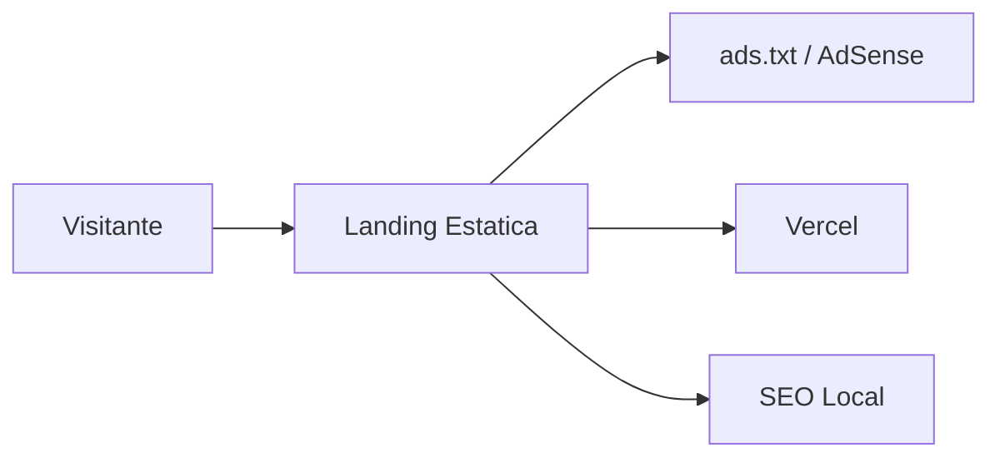

# Documentacion General del Sistema — Auto Lava Garcia / antojosbarlounge.com

> Documento para onboarding IT, mantenimiento web, AdSense y despliegue Vercel.

## 1. Vision General del Proyecto

Auto Lava Garcia / Antojos Bar Lounge es una landing estatica para negocio local bajo `antojosbarlounge.com`. El objetivo es presentar el negocio, mantener presencia digital, cumplir requisitos de AdSense y servir como base de marketing.

| Area | Detalle |
|---|---|
| Objetivo | Landing rapida, profesional y monetizable. |
| Publico | Clientes locales y visitantes del negocio. |
| Modelo | Sitio promocional + AdSense si aplica. |
| Hosting | Vercel. |

## 2. Arquitectura

## 3. Tecnologias

| Tecnologia | Uso |
|---|---|
| HTML/CSS/JS | Landing estatica. |
| Vercel | Hosting y dominio. |
| `vercel.json` | Redirect www y headers. |
| Google AdSense | Monetizacion si aplica. |

## 4. Funcionalidades

- Landing del negocio.
- Informacion de servicios/promociones.
- Footer legal.
- `ads.txt` en raiz.
- Redirect dominio www/non-www.
- SEO local basico.

## 5. Flujo del Usuario

1. Cliente entra desde Google/social.
2. Revisa informacion del negocio.
3. Consulta servicios, ubicacion o contacto.
4. Puede interactuar con anuncios si estan habilitados.

## 6. Estructura de Datos

Sitio estatico. Si crece:

| Entidad | Campos |
|---|---|
| `promotions` | `title`, `description`, `start_date`, `end_date`. |
| `services` | `name`, `description`, `price_cents`. |
| `events` | `title`, `date`, `details`. |

## 7. Seguridad

- No secrets en repo.
- No rewrites que oculten `ads.txt`.
- Revisar scripts externos.
- Mantener contacto sin exponer datos sensibles innecesarios.

## 8. UI/UX

Landing mobile-first, clara, con llamada a accion visible, imagenes optimizadas y carga rapida.

## 9. SaaS y Escalabilidad

No es SaaS. Puede evolucionar a sitio con reservas, menu digital, eventos y promociones.

## 10. Deployment

- Deploy en Vercel.
- Mantener `ads.txt` en raiz junto a `index.html`.
- `vercel.json` debe preservar `/ads.txt`.
- Verificar dominio y SSL despues de deploy.

## 11. Proximos Pasos

- Mejorar SEO local.
- Agregar schema.org LocalBusiness.
- Mantener paginas legales.
- Revalidar AdSense.
- Agregar formulario/contacto si el cliente lo pide.

## 12. Notas para IT

- No usar rewrite global que rompa `/ads.txt`.
- Prioridad: dominio, velocidad, SEO y cumplimiento publicitario.
